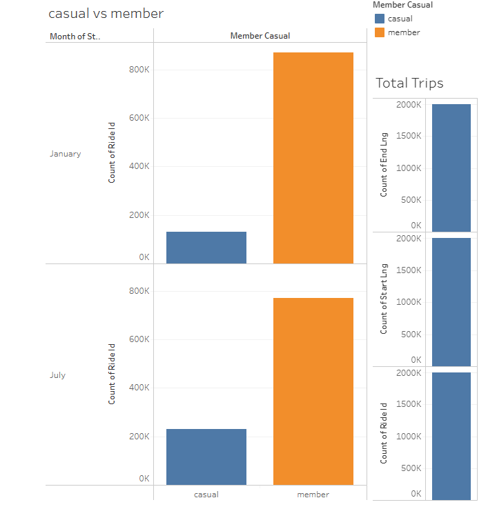

# NYC Citi Bike Analysis

# Summary:

This project involves analyzing data from the New York Citi Bike program to generate reports for city officials, aiming to improve program publicity and performance. By aggregating trip history logs and identifying unexpected phenomena, visualizations and dashboards will be created in Tableau to provide insights into ridership patterns, station popularity, and other relevant metrics.

# Tableau Link:

Tableau File Link: https://public.tableau.com/views/Module18Challenge_17104481869820/Analysisof2023CITIBikeRides-JanuaryJuly?:language=en-US&publish=yes&:sid=&:display_count=n&:origin=viz_share_link

# Data Source:

The Data that was used for this analysis was ride data from the Citi Bike Data webpage (https://www.citibikenyc.com/system-data). The time frame selected was January 2023 and July 2023 (2 months of total data). I combined the two spreadsheets using Pandas before uploading it to Tableau as one sheet. 

# Analysis of 2023 Rides in January VS July

1. Members VS Non-Members 

The charts in this dashboard showcase the number of riders that are members vs non-members. 
Based on a total of 2,000,000 unique rides, the majority of riders are members, but membership declined by about 100,000 between January and July. 
However, casual riders (non-members) increased by about the same amount between January and July. 
Perhaps vacation or financial budgeting needs have a part to play in this. It could be that some people cancel the membership during summer, 
and/or that there are more tourists using the bikes (whom do not have memberships). 

2. Top 10 & Peak Hours

The charts in this dashboard showcase the difference in start times between January and July, as well as the top 10 stations to start and end a ride at.
Most people started their rides between 4 PM and 5 PM in January. In July most people started their rides between 
5 PM and 6 PM. There is a difference in ride start times between January and July that is most likely due to the fact that the sun is out longer during summer. 
Across both months, I have listed the top 10 stations to start and end. The top station to end a ride is NYU Langone Hospital, 
and the top station to start a ride is right next to a high school in the financial district. Both are on opposite sides of Manhattan. 
It appears that the start station is getting use from high school kids as well as tourists and commuters 
(the financial district is a popular destination for both). It appears that the end station may also be used by a combination of students and commuters. 
The peak hours indicate a possible majority of commuters who work a somewhat normal variation of a 9 AM - 5 PM job, but the locations could also indicate 
some student usage. 

3. Bike Types: Distance & Count

This dashboard showcases each bike by the type of bike that it is. The data shows that the majority of bikes are classic bikes, which is your standard bicycle. 
The electric bikes have electrical components in them, and the classic bikes do not. The data below shows that the average mileage a classic bike gets is 
higher than that of an electric bike. It is hard to say if this is due to popularity, or if it's easier to ride them a longer distance than the electric bikes. 
Further analysis would be needed to answer this question. I believe there is also a misrepresentation with the docked_bike category in this data. According
to the information I have been able to find, most, if not all CITI Bikes are docked at docking stations. It appears that whether a bike is a classic bike, 
or an electric bike, it has nothing to do with whether it is docked or not. 

4. Bottom 10 Stations

This dashboard focuses on the bottom 10 start and end locations by ride count at the latitude of the start location. All of the bottom 10 start locations are outside of NYC. 
They are mixed between Hoboken and Jersey City. This tells us most people are not using the bikes to commute into Manhattan from NJ. In addition, the bottom 10 end locations, 
were a mix of different areas, but included Jersey City, Brooklyn, and queens. I believe this also confirms that most people are not using the bikes to commute outside 
of Manhattan.  

5. 15 Longest Rides

For this dashboard, I reviewed the trip duration between members and non-members. On average, non-member (casual) users had longer trip durations, but member users held the majority 
share of the 15 longest rides. Furthermore, a member was responsible for the longest ride, which occured in January, the colder of the two months analysed. Perhaps casual users are 
using the bikes less, but completing a longer trip, vs members who use the bikes more, but on shorter trips. 

6. Bike Station Map

This is a map showcasing all of the bike stations from the data I analyzed. The legend on the right shows the Top 10 Start Stations by ride count, the Top 10 End locations by 
ride count, and allows us to select which stations to show on the map. Click any colored box, and that station or set of stations will be highlighted on the map. If nothing from 
either legend is selected, the map will display all of the bike stations. At the bottom of the Top 10 Start Stations legend there is an option that says "Not a Top 10 Start". 
If this option is selected, the map will show all stations that are not a top 10 start station. The same option can be found in the end stations legend. The map also has 
two layers. The first layer is based on the "Origin Point" (the lat & lng of the station where each ride originated from), and contains all information regarding the start stations. The second 
layer is based on the "End Point" (the lat & lng of each station where each ride ended). You can hide both layers, select both, or select only one of the layers to view different combinations
of start and end data by ride count. 
It appears the start station data has some anamolies. In some cases, multiple start station locations show up for what should be a single location only. This is not the case for the end stations. 
Is it possible the bikes could be mis-coded? In addition to zip code data, I overlayed the male female ratio, and it appears the top start and end stations are in areas with 
slightly higher male populations vs female. 

